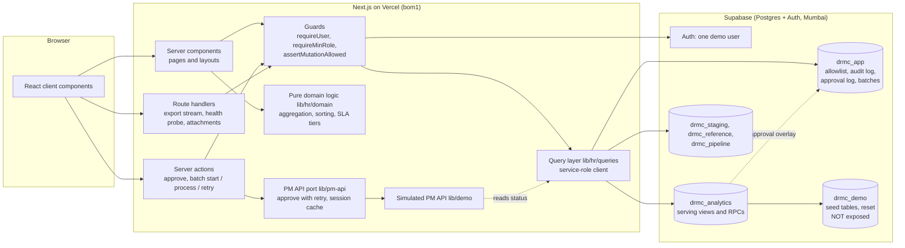

# DRMC demo

DRMC is a workforce report-compliance app. People file a daily report of the
hours they worked; team leads approve those reports in a project-management
system; managers need to see who is on the roster, what is waiting for
approval, how fast it gets approved, and whether the hours people state match
the hours their timers recorded. This repository is a working copy of that app
that anyone can run and click through.

This is a sanitized public demo of DRMC, an internal workforce report-compliance platform I designed and built. It contains a slice of the real application (directory, approvals with durable bulk approve, hours analysis) running in a permanent demo mode. Every person, team, client and number is invented, policy thresholds have been changed, integrations are simulated, and the features that encode HR policy or send email have been removed.

Stack: Next.js 16 (App Router, server components and server actions), React 19,
Supabase (Postgres + Auth), Tailwind CSS 4, TypeScript.

## What you can do in it

| Page | What it shows |
| --- | --- |
| `/signin` | The original sign-in page, with the single-sign-on button replaced by **Enter demo**. One click signs you in as a shared demo user with the `manager` role. |
| `/` Home | Role-aware KPIs: the members you approve, pending approvals and on-time rate for your groups, reports filed with no approver assigned, and a per-group breakdown. |
| `/directory`, `/employees/[id]` | The roster grouped by team, and a read-only profile with the member's approvers and schedule history. |
| `/approvals` | The awaiting-approval queue, oldest first, with wait-time tiers and the backlog per approver group. |
| `/approvals/browse` | The approval grid: infinite scroll, sortable and filterable column headers, a report detail drawer (requirements, a Gantt of the day's timer entries, attachment thumbnails), CSV / Excel exports that stream with progress, and **bulk approve**. |
| `/approvals/scorecard` | Approval performance per approver group, with a drill-down panel. |
| `/hr/variance` | Hours Analysis: a drillable heatmap of stated vs timed hours, box plots per member, a trend, a focus panel, a health-gated live refresh, and a print report at `/hr/variance/report`. |

### Try the durable bulk approve

On `/approvals/browse`, filter to one approver group, tick **Select all**, press
**Approve N selected**. The confirm dialog has a demo-only control, **simulate an
outage**. Pick "After 25" and approve:

1. the run stops after 25 reports as if the connection had dropped. The batch is
   still `running` in Postgres; press **Resume** (or reload the page, which
   adopts the running batch) and it continues where it left off;
2. the next five reports get 503s from the simulated API, exhaust their three
   attempts and are recorded as retryable failures; press **Retry**;
3. the batch finishes. No report is approved twice, whatever you do.

## Architecture



## Design decisions the code shows

**Service-role data layer behind a per-action guard.** The browser never talks
to the database. Every read and write goes through a server-side Supabase client
holding the service-role key (`lib/supabase/service.ts`), and every page, server
action and route handler first calls a guard itself (`lib/auth/require-user.ts`);
nothing relies on a layout having checked. In the database, RLS is enabled on
every table with no policies and privileges are granted to `service_role` only,
so the anon key, which is public, can reach nothing. The session is resolved
once per request with React `cache()` (`lib/auth/session.ts`).

**Durable bulk approve.** Approving hundreds of reports through a slow external
API cannot live in one request. A batch is a header row plus one item row per
report (`drmc_app.approval_batch`, `approval_batch_item`). The browser only
drives it: each call to the `processApprovalBatch` action claims the next chunk,
approves each report through the API port with retries, and commits each outcome
as it happens (`lib/hr/approvals/process-chunk.ts`). Claims use
`FOR UPDATE SKIP LOCKED`, so two runners never receive the same item and never
wait on each other; a claim older than two minutes is treated as abandoned and
can be claimed again. Progress is recomputed from the items, not trusted from
the header. A partial unique index allows one successful row per report in the
approval log, which is the idempotency backstop.

**Write-back through an HTTP port.** The approval code is written against a
two-method interface (`PmApiHttpLite` in `lib/pm-api/approve.ts`), not against
`fetch`. That is what lets the retry ladder, the 401 refresh, and the
"403 that really means already approved" read-back be unit tested with fakes,
and it is what lets this demo swap in a simulated implementation
(`lib/demo/pm-api.ts`) without touching the calling code.

**The approval overlay.** The serving view treats a report as approved when the
source data says so or when the app has a successful row in its approval log.
An approve is therefore visible to every reader on the next query, without the
app writing to data it does not own.

**Health-gated live refresh.** Pages poll for fresh data, but a background
refresh that fails server-side would replace the page the user is reading with
an error boundary. So the client first asks `/api/health/data`, which runs a
canary read on the same view family the pages depend on, and skips the refresh
(showing a stale badge) when the database is struggling
(`components/ui/LiveRefresh.tsx`, `lib/hr/domain/live-refresh-policy.ts`).

**Pure TypeScript aggregation with tests.** Heatmap cells, box-plot statistics,
trend buckets, the report model, the Gantt geometry, sort and filter parsing all
live in `lib/hr/domain` as framework-free functions with unit tests. The
database returns rows; the shaping is code you can test without a database.

**Preview / read-only guard, extended into an allowlist.** The original app lets
an administrator preview the app as another user, read-only:
`assertNotPreviewing()` sits at the top of every mutating action. The demo
extends the same pattern into `assertMutationAllowed(kind)`. Visitors share one
account, so the set of things that can change data is a closed list
(`lib/demo/mutations.ts`): approve, start a batch, process a batch, retry a
batch, and their audit rows. There is no persisted free text, no upload and no
settings page. Batch creation is rate limited in Postgres (200 reports per
batch, 10 batches per 10 minutes across all visitors).

## What was removed, and why

| Removed | Why |
| --- | --- |
| Compliance review, infraction and habitual-infraction rules, incident-report workflow | They encode HR policy. |
| Member explanations, the public explain form, file uploads | Policy workflow, and visitors must not be able to persist text or files. |
| DR Monitoring (late / missing / tardy / idle-gap flags), HR dashboard | Built on tardiness and filing policy flags; its RPCs could not be re-implemented faithfully from the callers within reason. |
| Revenue lens, rate and pay-period logic | Commercial data and pay rules. |
| All email: reminders, scheduled extracts, weekly member packs, mailbox OAuth, the four cron routes | Nothing may be sent. There is no mail transport in the dependency tree. |
| Users and access, org, activity log, settings, approver overrides, feedback tickets, employee create / edit | Administration and free-text writes; not part of the slice. |
| The per-user PM API credential form | A visitor could type a real password into it. The demo user is treated as already connected. |
| Server-side PDF rendering with headless Chromium | Replaced by the browser print view. |
| Presence, the daily "app opened" audit ping | Realtime and writes that are not approvals. |
| Deep links into the project-management system, attachment ZIP extracts | There is no such system behind the demo. Links are rendered inert; attachment thumbnails are generated placeholder images. |

Changed rather than removed: the hours-variance breach line, the report filing
window and the approval wait tiers use invented numbers, and the approval
deadline is a simple "within 2 days of submission" rule invented for the demo.

## Run it yourself

You need Node 20.9+ and a Supabase project (the free tier is enough).

1. **Database.** In the Supabase SQL editor run, in this order,
   `supabase/schema.sql`, `supabase/seed.sql`, `supabase/reset_demo.sql`. All
   three are idempotent. Everything they create lives in `drmc_*` schemas; they
   touch nothing else, so the project can be shared with other apps.
2. **Exposed schemas.** Project Settings -> API -> Exposed schemas: add exactly
   `drmc_app, drmc_analytics, drmc_staging, drmc_reference, drmc_pipeline`.
   Do not add `drmc_demo`.
3. **Demo user.** Authentication -> Users -> Add user: `demo@example.com`, a
   password of your choice, "Auto confirm user" on. The seed already maps that
   address to a `manager` row in `drmc_app.hr_app_user`.
4. **Environment.** `cp .env.example .env.local` and fill in the five values.
5. **Run.** `npm install`, then `npm run dev`, open http://localhost:3000.
6. **Nightly reset (optional).** With the `pg_cron` extension enabled, run once:
   `select cron.schedule('drmc-demo-reset', '20 19 * * *', $$select drmc_demo.reset_demo()$$);`
   The seed's dates are relative to `current_date`, so after each reset the
   queue looks recent again.

## Deploy to Vercel

Import the repository, set the same five environment variables (do not set
`DEMO_AUTH_BYPASS_FOR_LOCAL_TESTS`), deploy. `vercel.json` pins the functions to
`bom1` (Mumbai) because the demo database is there; change the region to sit
next to your own database. The build does not talk to Supabase.

## Tests

| Command | What it runs |
| --- | --- |
| `npm run lint` | ESLint, zero warnings allowed. |
| `npm run typecheck` | `next typegen && tsc --noEmit`. |
| `npm test` | Unit tests of the pure domain logic, the API port and the demo guards. They run under Playwright's test runner, with no browser and no database. |
| `node scripts/check-unused.mjs` | Fails if any source file is unreachable from a route, or an import does not resolve. |
| `npm run build` | Production build. |

Those run in CI (`.github/workflows/ci.yml`, Node 20). Two more suites need a
local database and are run by hand:

```
docker compose -f docker-compose.local.yml up -d   # Postgres 16 + PostgREST, five schemas exposed
npm run db:apply      # roles, then schema / seed / reset, each applied twice
npm run db:race       # two sessions claim from one batch: disjoint, nothing lost
npm run test:db       # the real query layer through supabase-js, and the full
                      # outage -> resume -> retry flow with database cross-checks
node scripts/local/gateway.cjs &                   # /rest/v1 prefix for supabase-js
npx next dev -p 3117                               # with DEMO_AUTH_BYPASS_FOR_LOCAL_TESTS=true
npm run test:e2e      # Playwright over every page, incl. bulk approve in the browser
```

The local stack has no Auth service, so those runs use
`DEMO_AUTH_BYPASS_FOR_LOCAL_TESTS=true`, which treats every request as the demo
user. It is ignored when `NODE_ENV=production` or when any `VERCEL*` variable is
set (`lib/demo/mode.ts`, pinned by a unit test).

## Limits

- One shared account: what one visitor approves, every visitor sees until the
  nightly reset. Two visitors cannot run a bulk approve at the same time; the
  second is told one is already running.
- The PM API is simulated. Latency, idempotency and failures are modelled;
  nothing else about a real project-management system is.
- The data-freshness label reads a simulated pipeline heartbeat (a view that
  reports a successful run every ten minutes).
- The SQL in `supabase/` was written for this demo from the application's query
  layer. It is not the production warehouse, which computes much more.
- Timestamps are shown in the two zones the original team works across
  (PHT and ET), which is why the code talks about them.

## License

MIT. See `LICENSE`.
